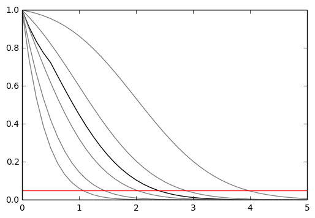
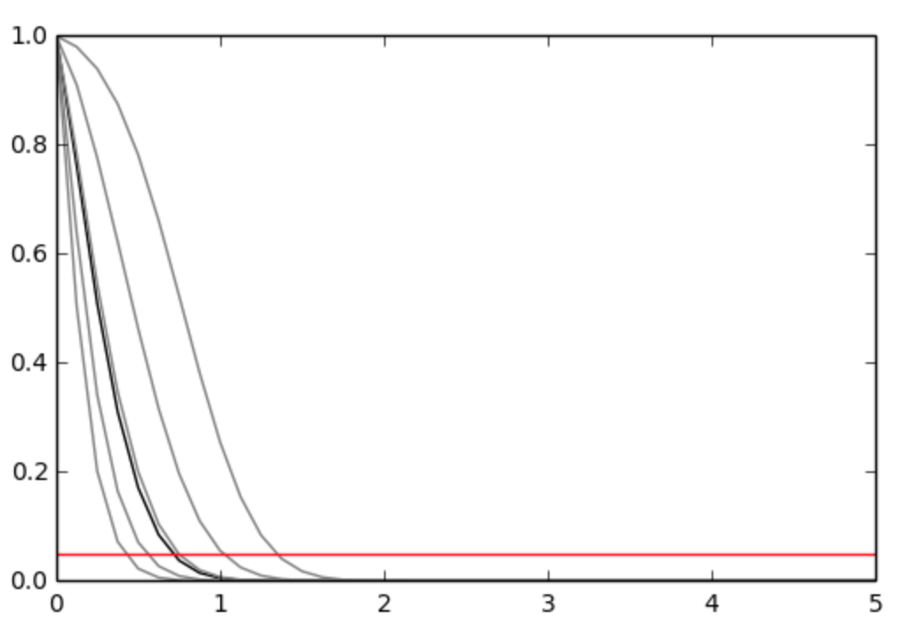

# pure-python fitting/limit-setting/interval estimation HistFactory-style

[](https://travis-ci.org/lukasheinrich/pyhf)
[](https://coveralls.io/github/lukasheinrich/pyhf?branch=master)
[](https://badge.fury.io/py/pyhf)
[](https://mybinder.org/v2/gh/lukasheinrich/pyhf/master)

The HistFactory p.d.f. template is per-se independent of its implementation in ROOT and sometimes, it's useful to be able to run statistical analysis outside
of ROOT, RooFit, RooStats framework.

This repo has some example code for multi-bin histogram-based analysis based on the asymptotic formulas of "Asymptotic formulae for likelihood-based tests of new physics" [[arxiv:1007.1727](https://arxiv.org/abs/1007.1727)].

## What does it support

Implemented variations
- [x] HistoSys
- [x] OverallSys
- [x] ShapeSys
- [x] NormFactor
- [x] Multiple Channels
- [x] Import from XML + ROOT via `uproot` (https://github.com/scikit-hep/uproot)
- [x] ShapeFactor

## Todo
- [ ] StatError
- [ ] StatConfig
- [ ] Non-asymptotic calculators

results obtained from this package are validated against output computed from HistFactory workspaces

## A one bin example

```
nobs = 55, b = 50, db = 7, nom_sig = 10.
```




## A two bin example

```
bin 1: nobs = 100, b = 100, db = 15., nom_sig = 30.
bin 2: nobs = 145, b = 150, db = 20., nom_sig = 45.
```




## Installation
To install `pyhf` run
```bash
python setup.py install
```
To uninstall run
```bash
pip uninstall pyhf
```

## Authors

Please check the [contribution statistics for a list of contributors](https://github.com/lukasheinrich/pyhf/graphs/contributors)
